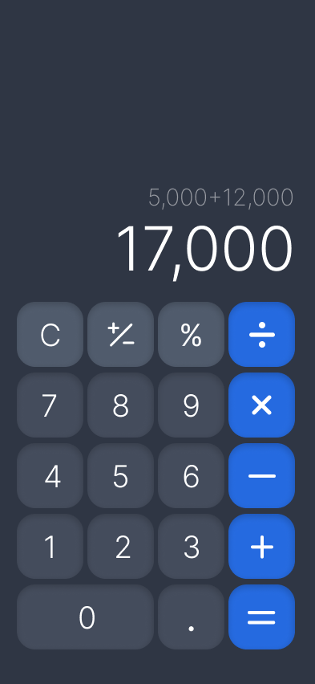

# 🧮 Calculadora Mobile - React Native

## 📌 Visão Geral

Aplicativo de calculadora desenvolvido em React Native, projetado para oferecer uma experiência de uso simples, intuitiva e responsiva. O layout foi pensado para facilitar a visualização das operações e proporcionar agilidade nos cálculos do dia a dia.

---

## ✅ Etapas do Projeto

- [x] Levantamento de requisitos
- [x] Criação do layout no Figma
- [ ] Desenvolvimento da interface
- [ ] Implementação da lógica de cálculo
- [ ] Testes em dispositivos móveis
- [ ] Publicação do código e documentação final

---

## ⚙️ Especificações Técnicas

### Funcionalidades esperadas

- Entrada de números inteiros de **0 a 9**
- Uso de **ponto ou vírgula** para separação decimal
- Operações matemáticas básicas:
  - Adição
  - Subtração
  - Multiplicação
  - Divisão
- Cálculo de **porcentagem**
- Alternância de sinal (**positivo/negativo**)
- Exibição do resultado ao pressionar o botão de **igual**
- Botão para **limpar tudo** (AC)
- Botão para **apagar o último dígito** (backspace)
- Visor com duas linhas: expressão atual e resultado em destaque
- Atualização em tempo real do visor conforme o usuário digita

### Critérios técnicos

- Desenvolvido com **React Native**
- Compatível com **Android e iOS**
- Interface adaptável a diferentes tamanhos de tela
- Resposta instantânea ao toque nos botões
- Formatação de números no padrão brasileiro (**vírgula como separador decimal**)

---

## 🎨 Design e Prototipagem

### Conceito visual

O design foi elaborado no Figma com foco em usabilidade e clareza. A interface é dividida em duas áreas principais:

- **Área superior**: exibe a operação em andamento e o resultado com destaque visual
- **Área inferior**: teclado numérico e funcional em formato de grade

Elementos de destaque:

- Botão "=" com cor diferenciada para indicar ação principal
- Operadores com estilo distinto dos números
- Espaçamento equilibrado e contraste adequado para leitura

### Acesso ao protótipo

🔗 [Clique aqui para visualizar o projeto no Figma](https://www.figma.com/design/MQ6BelA0DwzDwr65Z8d89C/Calculadora-Henrique?node-id=1-2&t=nEkbpdlV4IDTKycR-1)

### Preview

---

## 📄 Próximos passos

- Desenvolvimento dos componentes em React Native
- Implementação da lógica de cálculos
- Validação em dispositivos físicos e emuladores
- Finalização da documentação técnica e de negócio
